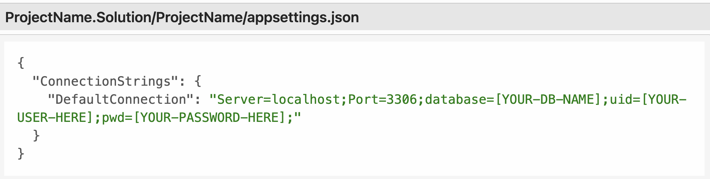

# Eau Claire's Salon
Names of contributors: By Viradeth Xay-ananh.  
MVC application for Claire owner of hair salon: Eau Claire's Salon

# Description 
MVC Web application that allows the owner(Claire) to add a stylist to a list and view all the list stylist working at Eau Claire's Salon.  The owner can also add muplitple clients to a stylist but the client is only allowed one stylist.    

## Technologies Used
* C#
* Dot Net 6.0
* Markup
* Git
* ASP.NET MVC
* css
* html5

# Complete setup/Installation instructions:
* Clone repository to your desktop 
* CD to the Directory: HairSalon 
* Connect to database, While in the current directory(HairSalon)  
* Create appsettings.json file 
* Replace the following values shown in image with: 
* [YOUR-DB-NAME]: database included in project
* [YOUR-USER-HERE]: with your username
* [YOUR-PASSWORD-HERE]: with your password
* Add appsettings.json file to .gitignore to protect the sensitive data
* To view web application. Run commands: dotnet watch run 
* Open the browser, go to https://localhost:5001

# Known bugs: 
No bugs 

## License

[MIT](https://opensource.org/licenses/MIT)  
Copyright (c) _03/03/2023_ _viradeth xay-ananh_